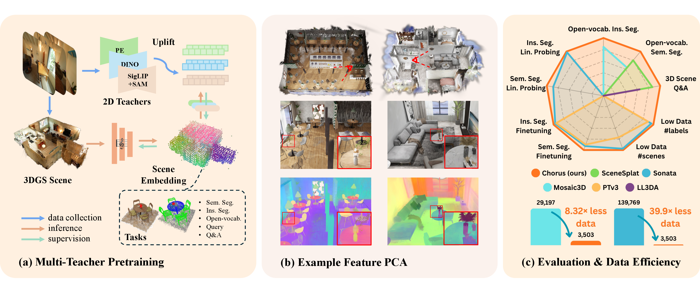

#  Chorus: Multi-Teacher Pretraining for Holistic 3D Gaussian Scene Encoding

### CVPR 2026 (Oral Presentation)

[](media/teaser.png)

[Yue Li<sup>&Dagger;,*</sup>](https://unique1i.github.io/), [Qi Ma<sup>*</sup>](https://qimaqi.github.io/), [Runyi Yang](https://runyiyang.github.io/), [Mengjiao Ma](https://scholar.google.com/citations?user=4_JSQPQAAAAJ), [Bin Ren](https://amazingren.github.io/), [Nikola Popovic](https://scholar.google.com/citations?user=aY2lypgAAAAJ), [Nicu Sebe](https://disi.unitn.it/~sebe/), [Theo Gevers](https://staff.science.uva.nl/th.gevers/), [Luc Van Gool](https://insait.ai/prof-luc-van-gool/), [Danda Pani Paudel<sup>&dagger;</sup>](https://insait.ai/dr-danda-paudel/), [Martin R. Oswald<sup>&dagger;</sup>](https://oswaldm.github.io/)

&Dagger; Project lead. \* Equal contribution. &dagger; Equal supervision.

Chorus is a multi-teacher pretraining framework for 3D Gaussian scene encoding, which trains in end-to-end manner a hoslistic scene encoder with strong data efficiency. This release includes the Chorus multi-teacher language pretraining pipeline, the 2D adaptation pipeline, and standalone inference for both preprocessed 3DGS folders and raw 3DGS `.ply` inputs.

## Installation

We provide two tested conda environments. `env.yaml` is with Python 3.10, PyTorch 2.5.1, and CUDA 12.4. `env_cu126.yaml` is the newer CUDA 12.6 environment with PyTorch 2.7.1. If you are using micromamba 2.6.0+, please set `micromamba config set use_sharded_repodata false` for solving the environment.

```bash
PIP_NO_BUILD_ISOLATION=0 conda env create -f env.yaml
conda activate chorus
```

For the CUDA 12.6 variant:

```bash
PIP_NO_BUILD_ISOLATION=0 conda env create -f env_cu126.yaml
conda activate chorus
```

## Quick Inference

Chorus 3DGS inference supports:

- standard Gaussian `.ply`
- compressed SuperSplat `.ply`
- preprocessed scene folder with Gaussian params in `color.npy, coord.npy, opacity.npy, quat.npy, scale.npy`

Set the input and output paths once, then use the same `OUTPUT_DIR` for later PCA visualization and Mini Viewer as well:

```bash
export INPUT_ROOT=/path/to/processed_scene_or_ply
export OUTPUT_DIR=/path/to/chorus_outputs/scene_name
```

```bash
python -m tools.lang_inference \
  --config chorus_3dgs \
  --checkpoint lang-dino-enc-pretrain-scan-ppv2-mp3d-mcmc \
  --input-root "$INPUT_ROOT" \
  --output-dir "$OUTPUT_DIR"
```
With optional args:
```bash
  --pca_vis # optional PCA visualization on saved features; if omitted, PCA can be run separately with scripts/pca_colorize_features.py
  --no_save # to skip saving the features
  --disable-outlier-filter # Raw `.ply` inference applies the outlier filter by default, use this flag to disable the filter.
```

Running point-cloud variant of Chorus for preprocessed folders with `coord.npy`, `color.npy`, and `normal.npy`:

```bash

python -m tools.lang_inference \
  --config chorus_pts \
  --checkpoint lang-dino-enc-pretrain-ppv2-mcmc-from-pts-params \
  --input-root "$INPUT_ROOT" \
  --output-dir "$OUTPUT_DIR"
```

### Mini Viewer Visualization

We provide a simple [Mini Viewer](https://github.com/RunyiYang/Mini_Viewer) for visualizing the original 3DGS scene and the saved language features after Chorus inference.

Install Mini Viewer into the `chorus` conda env from the commit:

```bash
python -m pip install "git+https://github.com/RunyiYang/Mini_Viewer.git@6c8e5c938844487319a92e19f952e76cd4eba847"
```

Mini Viewer uses gsplat for the fast CUDA renderer. Run this once after installing Mini Viewer so the long gsplat JIT build happens before the first viewer session:

```bash
python -m tools.mini_viewer --precompile-gsplat
```

After running Chorus inference, launch Mini Viewer on the original source scene and the saved language features. Use the same `--output-dir` from `tools.lang_inference`:

```bash
python -m tools.mini_viewer \
  --input-root "$INPUT_ROOT" \
  --output-dir "$OUTPUT_DIR"
```

By default this resolves to the feature path `<output-dir>/<scene>_lang_feat.pt` and uses `--feature-type siglip2`.

### Batch Inference

For multiple inputs, `scripts/run_inference.sh` is the simple batch wrapper around `tools.lang_inference`. It is meant for input roots like `root_dir/scene_a/*.npy`, `root_dir/scene_b/*.npy`, ... or `root_dir/a.ply`, `root_dir/b.ply`, the output structure is  `<batch_output_root>/<scene_name>/...`.

```bash
bash scripts/run_inference.sh \
  --input-root /path/to/batch_input_root \
  --output-dir /path/to/batch_output_root
```

Add `--disable-outlier-filter` if you want batch raw-Ply inference without pruning.

### Notes

>- `chorus_3dgs` config supports preprocessed scene folders with `*.npy` files, raw standard Gaussian `.ply`, and raw compressed SuperSplat `.ply`.
>- `chorus_pts` config is npy-only and expects `coord.npy`, `color.npy`, and `normal.npy`.
>- Raw `.ply` inference enables the outlier filter by default. Use `--disable-outlier-filter` if you want to keep all splats for inference.
>- Chorus supports inference on scenes with millions of splats. The GPU memory cost depends on the input splats number, density and the grid_size in the test_cfg. We measured around `22 GiB` for scenes with`~500k` splats and around `48 GiB` for `~1.5M` splats with the default config.
>- `--pca_vis` runs PCA right after inference on the saved features. If you prefer a separate step, use `scripts/pca_colorize_features.py`.


## Package Mode

Chorus also provides an inference-only package mode for users who want to use the 3DGS encoder directly in their code. Use `install_package_deps.sh` for package mode installation. It first installs the dependencies first, then installs the local `chorus` package.

```bash
bash scripts/package/install_package_deps.sh --track cu124
# or
bash scripts/package/install_package_deps.sh --track cu126
```

Use `cu124` for the `env.yaml` track (CUDA 12.4 / PyTorch 2.5.1) and `cu126` for the `env_cu126.yaml` track (CUDA 12.6 / PyTorch 2.7.1). The exact versions are listed in the requirements files:

```text
scripts/package/requirements-cu124.txt
scripts/package/requirements-cu126.txt
```

For optional Mini Viewer support in package mode, please add the `--viewer` flag:

```bash
bash scripts/package/install_package_deps.sh --track cu126 --viewer
```

For manual installation, please refer to the requirements file directly and install them before installing Chorus:

```bash
python -m pip install -r scripts/package/requirements-cu124.txt
python -m pip install -e . --no-deps
python -c "import torch, spconv, torch_scatter, flash_attn, chorus; print(torch.__version__, chorus.__version__)"
chorus-encode --help
```

The default Python API returns features without writing files:

```python
import chorus

encoder = chorus.load("chorus_3dgs")
out = encoder.encode("/path/to/processed_scene_or_ply")
lang = out.features["lang"]  # input-aligned N x 1152 feature array
```

Supported package modes are `chorus_3dgs` and `chorus_pts`. By default, `chorus.load("chorus_3dgs")` resolves `lang-dino-enc-pretrain-scan-ppv2-mp3d-mcmc` from the [Chorus Hugging Face model repo](https://huggingface.co/SceneSplatPro/Chorus), while `chorus.load("chorus_pts")` resolves `lang-dino-enc-pretrain-ppv2-mcmc-from-pts-params`. Pass `checkpoint="/path/to/model.pth"` to load a local checkpoint instead.

Configurable outputs are `lang`, `dino`, `backbone_upcast`, and `backbone_last`:

```python
encoder = chorus.load(
    "chorus_3dgs",
    outputs=("lang", "dino", "backbone_upcast", "backbone_last"),
)
out = encoder.encode("/path/to/scene.ply", output_dir="/path/to/features")
```

`lang`, `dino`, and `backbone_upcast` are aligned to the input splat/point rows after any raw-Ply filtering. `backbone_last` is a structured low-resolution token from the last encoder layer, outputing with `feat`, `coord`, `grid_coord`, `offset`, and `fragment_index`; it is not input-row aligned.

Package CLI:

```bash
chorus-encode \
  --mode chorus_3dgs \
  --input-root "$INPUT_ROOT" \
  --output-dir "$OUTPUT_DIR" \
  --outputs lang
```

Optional Mini Viewer package command:

```bash
chorus-viewer --input-root "$INPUT_ROOT" --output-dir "$OUTPUT_DIR"
```

## Training Data Preparation

The full Chorus pretraining data for the joint training is close to 20TB in storage. Given the sheer amount, we release the complete repos we used to obtain the data which cover the steps: start from the already released 3DGS `*.npy` datasets, 2D feature map extraction with SigLIP2/SAM2, OccamLGS language feature lifts, LUDVIG DINOv3/PE-Spatial feature lifts, then merge and chunk to the final training samples.

See [pretraining_data.md](pretraining_data.md) for the detailed steps, repo links, split usage, and chunking commands.

## Multi-teacher Pretraining

The main Chorus configs are under `configs/chorus/` for the `LangPretrainerMultiTeacher` class.

### Pretraining Configs

Train from scratch with:

```bash
python -m tools.train \
  --config-file configs/chorus/concat_dataset/lang-dino-enc-pretrain-scan-ppv2-mp3d-mcmc.py \
  --options save_path=exp_runs/lang_pretrainer/chorus/concat_dataset/lang-dino-enc-pretrain-scan-ppv2-mp3d-mcmc \
  --num-gpus <n>
```

Test only with a trained checkpoint, with the test data in the config:

```bash
python -m tools.train \
  --config-file configs/chorus/concat_dataset/lang-dino-enc-pretrain-scan-ppv2-mp3d-mcmc.py \
  --options test_only=True weight=<ckpt_path> save_path=<exp_path> \
  --num-gpus <n>
```

If needed to change the dataset root with CLI, please override the nested fields used by the dataloaders. For example, for the concat config:

```bash
python -m tools.train \
  --config-file configs/chorus/concat_dataset/lang-dino-enc-pretrain-scan-ppv2-mp3d-mcmc.py \
  --options \
    data.train.datasets.0.data_root=/path/to/scannetpp_root \
    data.val.0.data_root=/path/to/scannetpp_root \
    ...
    save_path=exp_runs/lang_pretrainer/chorus/debug_run \
  --num-gpus 1
```

## Working with Custom Data

Run these commands from the repo root. `python -m tools.lang_inference` accepts the short aliases `chorus_3dgs` and `chorus_pts`. If `--output-dir` is omitted, both inference and PCA visualization write to `<repo_root>/outputs`. Inference is CUDA-only now.

Released checkpoints are hosted in the [Chorus Hugging Face model repo](https://huggingface.co/SceneSplatPro/Chorus). Please first request access on Hugging Face. After authenticating, the inference CLI accepts either a local path or one of these checkpoint names directly:

| Checkpoint name | Inference alias | Inputs | What it represents |
| --- | --- | --- | --- |
| lang-dino-enc-pretrain-scan-ppv2-mp3d-mcmc | `chorus_3dgs` | 3DGS params: `color`, `opacity`, `quat`, `scale` | Main release model trained jointly with SigLIP2 language targets and DINO targets on ScanNet++, ScanNet, and Matterport3D 3DGS data. |
| lang-dino-enc-pretrain-ppv2-mcmc-from-pts-params | `chorus_pts` | point params: `coord`, `color`, `normal` | Point-parameter variant trained with the same language/DINO teacher setup on ScanNet++ data. |

Use `chorus_3dgs` for preprocessed 3DGS folders, standard Gaussian `.ply`, or compressed SuperSplat `.ply`. Use `chorus_pts` only for preprocessed folders with `coord.npy`, `color.npy`, and `normal.npy`.

### Export `*.npy` from Raw PLY

If you want to convert raw `.ply` files into parameter folders first:

```bash
python scripts/preprocess_gs.py \
  --input /path/to/raw_scene_or_dir \
  --output /path/to/preprocessed_output
```

The export script also supports compressed `.ply`, and it uses the same default outlier filter as inference. Add `--disable-outlier-filter` to export the raw splats without pruning.

### PCA Colorization Only

If you already have a saved feature file and want to visualize it separately:

```bash
python scripts/pca_colorize_features.py \
  --feature-path /path/to/saved_feature.pt \
  --input-root /path/to/original_scene_or_ply \
  --device cuda
```

This script writes a colored point cloud `.ply`, and it also writes a feat-vis 3DGS `.ply` when the source input provides `opacity`, `scale`, and `quat`. If `--device` is omitted, PCA defaults to CPU.

## 2D Adaptation With Custom Data

2D adaptation is the proposed workflow for finetuning Chorus on custom 3DGS data, without requiring preparing the teacher features in advance. It is registered as
`LangPretrainerMultiTeacher2D` and is not used by the
`LangPretrainerMultiTeacher` pretraining or inference path. The extra renderer
dependency is `gsplat==1.4.0`.

The optional PE-Spatial examples also need `perception_models` source
tree. Please use a local checkout instead and export
it before launching the configs using it:

```bash
git clone https://github.com/facebookresearch/perception_models.git /path/to/perception_models
export PERCEPTION_MODELS_ROOT=/path/to/perception_models
export PYTHONPATH=$PERCEPTION_MODELS_ROOT:$PYTHONPATH
```

The example config is the following one that adapts by the DINO teacher:

```bash
configs/chorus/2d_adaption/dino-only-enc-pretrain-interior-mcmc_lora.py
```
For InteriorGS preprocessing, see `scripts/interiorgs_process/README.md`. We also provide a demo of processed data in [mini_test.zip](https://drive.google.com/file/d/1psSiDbB0jfJlm7CcLGjD1Eeg0-iy4gDs/view?usp=sharing). 

The expected per-scene input layout for 2D adaptation is:

```bash
<data_root>/<split>/<scene_id>/
├── color.npy
├── coord.npy
├── opacity.npy
├── quat.npy
├── scale.npy
├── segment.npy
├── render_filtered/                         # preferred; render/ is fallback
├── transforms_camera_positions_filtered.json
├── visiable_gaussian_masks_per_frame_filtered_box_mask.npy
└── visiable_gaussian_masks_per_frame_filtered_pair_top4.npy
```

Fresh 2D adaptation should initialize from the released Chorus checkpoint via
`model.backbone_path`. Do not pass the base Chorus checkpoint through `weight`;
`weight` is only for resuming or evaluating an already adapted checkpoint.

Example:

```bash
python -m tools.train \
  --config-file configs/chorus/2d_adaption/dino-only-enc-pretrain-interior-mcmc_lora.py \
  --options \
    model.backbone_path=/path/to/released_chorus/best_lang.pth \
    data.train.data_root=/path/to/2d_adaptation_root \
    data.val.data_root=/path/to/2d_adaptation_root \
    save_path=exp_runs/lang_pretrainer/chorus/2d_adaption/dino-only \
  --num-gpus 1
```

Useful config fields:

- `resize_w`, `resize_h`: rendering resolution used by the differentiable 2D supervision path.
- `downsample_ratio_2D`: supervision feature-map downsample ratio.
- `teacher_2D_model`: Hugging Face 2D teacher name; adjust projector output channels if changing teacher families.
- `online_image`: renders GS images online before 2D teacher encoding; `False` loads rendered image files.
- `render_dir_name` and `pair_top_k`: dataset artifact selection, defaulting to `render_filtered` and `4`.

The 2D adaptation examples use the smaller 768-D DINOv3-B and SigLIP2-base
feature spaces. Therefore
`configs/chorus/concat_dataset/lang-dino-enc-pretrain-scan-ppv2-mp3d-mcmc-eval-after-2d-adapt-w-lora.py`
is eval-only for adapted LoRA checkpoints; do not use it to train on the
normal concat pretraining data, whose stored release targets are 1152-D
SigLIP2-SO400M language features and 1024-D DINO features. For `lang`
zero-shot evaluation, load a checkpoint adapted with a SigLIP2 teacher.

After LoRA-based adaptation, the adapted model can be probed with, e.g.:

```bash
configs/chorus/2d_adaption/semseg-gs-ptv3m2-interior-gs-2d-adapter-lin.py
```

Set the adapted checkpoint as `weight=<adapted_ckpt>`.

## Citation

```bibtex
@InProceedings{Li_2026_CVPR,
    author    = {Li, Yue and Ma, Qi and Yang, Runyi and Ma, Mengjiao and Ren, Bin and Popovic, Nikola and Sebe, Nicu and Gevers, Theo and Van Gool, Luc and Paudel, Danda Pani and Oswald, Martin R.},
    title     = {Chorus: Multi-Teacher Pretraining for Holistic 3D Gaussian Scene Encoding},
    booktitle = {Proceedings of the IEEE/CVF Conference on Computer Vision and Pattern Recognition (CVPR)},
    month     = {June},
    year      = {2026},
    pages     = {21431-21442}
}
```

## Acknowledgement

This codebase is developed based on the [SceneSplat](https://github.com/unique1i/SceneSplat) and [Pointcept](https://github.com/pointcept/pointcept) codebase. We sincerely thank the authors of [Pointcept](https://github.com/pointcept/pointcept), [OccamLGS](https://github.com/insait-institute/OccamLGS), and [LUDVIG](https://github.com/naver/ludvig) for their contributions!
